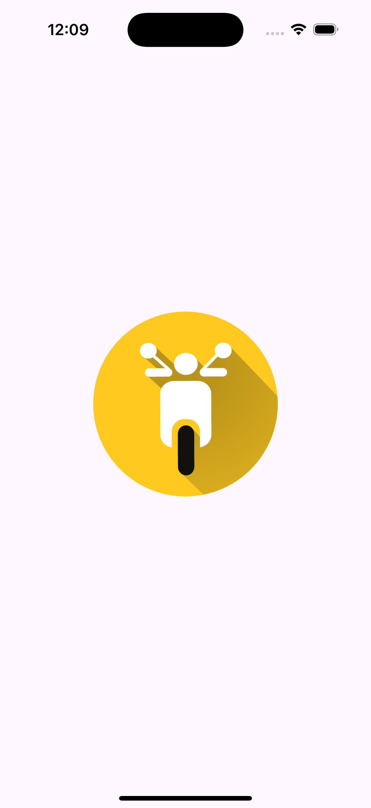
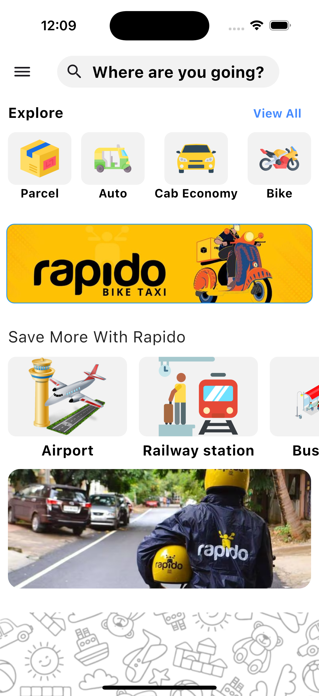
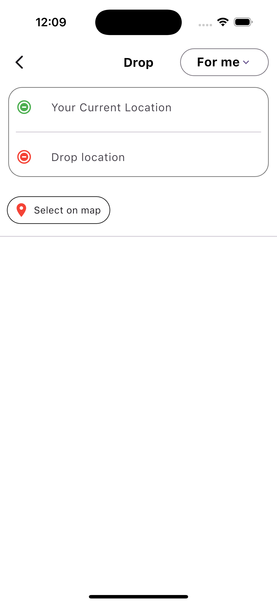
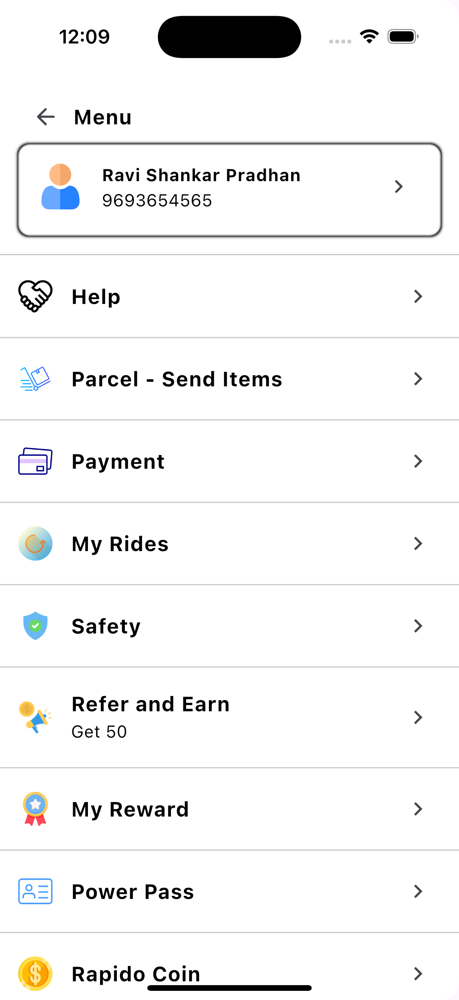

# Rapido UI-Clone App

This is a simple Flutter application.

## Getting Started

1. **Component Library**: Offer a comprehensive library of customizable UI components, such as buttons, cards, forms, and modals, that can be easily integrated and styled to match user needs, streamlining the development process.

2. **Drag-and-Drop Functionality**: Implement an intuitive drag-and-drop interface that allows users to create and customize layouts effortlessly, making it easy to design responsive UIs without extensive coding knowledge.

3. **Theme and Style Customization**: Provide options for users to customize themes, colors, and styles, enabling them to create unique designs that align with their brand identity while maintaining consistency across components.

4. **Real-Time Preview**: Include a real-time preview feature that allows users to see their design changes instantly, facilitating an interactive and iterative design process that enhances productivity and creativity.

5. **Export and Code Generation**: Enable users to export their designs as clean, responsive HTML/CSS or code snippets for popular frameworks, making it easy to integrate their UI designs into existing projects or share with developers.

## App Screenshot

Here are the screenshots of the app:

